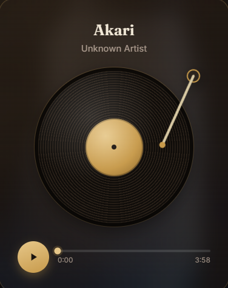

<p align="center">
  🎵
</p>

<h1 align="center">🎵 music-player</h1>

<p align="center">
  Turn any audio file into a self-contained vinyl record player — one HTML file, no server, no build step.
</p>

<p align="center">
  <a href="https://www.npmjs.com/package/@hell0beta/music-player-cli" target="_blank" rel="noopener noreferrer"></a>
  <a href="https://github.com/Hell0Beta/music-player" target="_blank" rel="noopener noreferrer"></a>
  <a href="LICENSE" target="_blank" rel="noopener noreferrer"></a>
  
</p>

---

## 🎧 About

`music-player-cli` is a tiny CLI that bakes an audio file — plus optional background and cover art — into a single HTML file: a physical-feeling **vinyl record player** with a tonearm that swings on when you press play, a disc that spins only while sound plays, and a frosted translucent plinth floating over a dimmed backdrop.

The output needs **no server, no build tools, and no runtime dependencies** beyond two Google Fonts. Email it, host it as one static file, or drop it into any CMS — it just opens in a browser.

```sh
npx @hell0beta/music-player-cli --name "Akari" --artist "Soushi Sakiyama" \
  --audio song.m4a --img background.png --palette 1 --open
```

---

## 📸 Screenshots

<div align="center">
  
</div>

<br />

|                          Default vinyl                           |                        Cover art on the disc                         |
| :--------------------------------------------------------------: | :------------------------------------------------------------------: |
|  |  |

---

## ✨ Features

- 🎙️ **Tonearm drop** – pressing play visibly engages the mechanism: the arm swings in, the disc starts spinning, and only then does sound begin
- 💿 **Spin = playback state** – the disc never spins while paused, exactly like a real turntable
- 🪟 **Frosted translucent card** – the player plinth uses `backdrop-filter` blur so the room behind it bleeds through
- 🖼️ **Backdrop & cover art** – full-page background behind the player (dimmed by a gradient veil) and round album art on the disc (vignette-shaded, spinning with the record)
- 📦 **Single-file output** – audio + images embedded as base64; the whole player is one portable `.html`
- ⌨️ **Keyboard controls** – `Space` play/pause, `←` / `→` seek ±5 seconds
- 🎨 **Four palettes** – brass & mahogany, blue hour, emerald lounge, burgundy booth (`--palette`, both CLIs)
- 🔀 **Multi-track** – two or more entries in `TRACKLIST` and prev/next controls with an `X / Y` counter appear automatically
- ♿ **Reduced motion aware** – `prefers-reduced-motion` disables the spin and tonearm animation
- 🪶 **Zero dependencies** – plain HTML/CSS/JS; the only network requests are Google Fonts

---

## ⚡ Quick Start

### One-off (no install)

```sh
npx @hell0beta/music-player-cli --name "Akari" --artist "Soushi Sakiyama" \
  --audio "song.m4a" --img "background.png" --shade 0.72 --open
```

### Global install

```sh
npm install -g @hell0beta/music-player-cli

music-player-cli --name "Demo" --audio demo.mp3 --cover art.jpg --shade 0.5 --open
```

### From source

```sh
git clone https://github.com/Hell0Beta/music-player.git
cd music-player
npm link        # exposes `music-player-cli` (alias: `music-player`)
music-player-cli --help
```

The generated file lands next to the project as `<song-name-slug>.html` (or wherever `--out` points). Open it in any browser — double-click works.

---

## 🎛️ Options

| Flag        | Description                                                            | Default                       |
| ----------- | ---------------------------------------------------------------------- | ----------------------------- |
| `--name`    | **Required.** Track title                                              | —                             |
| `--audio`   | **Required.** Audio file (`.m4a .mp3 .wav .ogg .aac`), embedded base64 | —                             |
| `--artist`  | Artist name                                                            | `Unknown Artist`              |
| `--img`     | Full-page background image (`.png .jpg .webp .gif`), gradient veil applied | none                     |
| `--cover`   | Album art for the spinning disc (`.jpg .png .webp`), vignette shade applied | none                    |
| `--shade`   | Backdrop dimming strength, `0..1` — higher = darker                    | `0.72`                        |
| `--palette` | Palette index `0`–`3`: brass & mahogany, blue hour, emerald lounge, burgundy booth | `0`               |
| `--out`     | Output file path                                                       | `<music-player>/<slug>.html`  |
| `--open`    | Open the result in your default browser                                | off                           |
| `--help`    | Show help                                                              | —                             |
| `--version` | Show version                                                           | —                             |

`--flag value` and `--flag=value` both work.

---

## 🐍 Python generator (optional)

A mirror of the Node CLI for Python-only environments — same template, same output:

```sh
python music-player.py \
  -a "C:/Users/You/Music/song.m4a" \
  -n "Akari" -A "Soushi Sakiyama" \
  -i "background.png" -c "cover.jpg" \
  -s 0.72 -p 0 --open
```

| Flag         | Description                                        | Default   |
| ------------ | -------------------------------------------------- | --------- |
| `-a`         | **Required.** Audio file                           | —         |
| `-n`         | Track title                                        | filename  |
| `-A`         | Artist                                             | `Unknown Artist` |
| `-i`         | Full-page background image (veil applied)          | none      |
| `-c`         | Cover art for the disc (vignette applied)          | none      |
| `-s`         | Shade, `0..1`                                      | `0.72`    |
| `-p`         | Palette `0`–`3` (brass, blue hour, emerald, burgundy) | `0`     |
| `-o`         | Output path                                        | `<slug>.html` |
| `--open`     | Open in browser                                    | off       |

Only dependency: Python 3.

---

## 📁 How it works

| File                | Purpose                                                                                                             |
| ------------------- | ------------------------------------------------------------------------------------------------------------------- |
| `template.html`     | The engine — markup, styles, playback logic, and the `__TRACKLIST__` marker. Single source of truth for the design.  |
| `cli.js`            | The `music-player-cli` Node command. Base64-encodes media, fills the marker, writes a finished HTML file.            |
| `cli-usage.txt`     | Help text for `music-player-cli --help`.                                                                            |
| `package.json`      | Exposes `cli.js` as the `music-player-cli` bin (`music-player` alias).                                              |
| `music-player.py`   | Python generator with palette support.                                                                              |
| `index.html`        | The demo player — viewable immediately.                                                                             |
| `design.md`         | Design rationale: palette, type, layout, gradient veils, and why.                                                   |
| `development.md`    | Architecture notes: data model, embedding, scrubbing, known limitations.                                            |

### Data model

All track content lives in one JS array near the top of the `<script>`:

```js
const TRACKLIST = [
  {
    title: "Midnight Drive",
    artist: "Unknown Artist",
    audioSrc: "",        // base64 audio data URI
    coverImage: "",      // optional — album art on the disc
    backdropImage: "",   // optional — full-page background
    shade: 0.72          // optional — backdrop dimming, 0..1
  },
  // ...more tracks
];
```

### Size note

Base64 embedding inflates files by **~33%**, and browsers hold the whole data URI in memory. Keep audio under **~15 MB** and images under **~3 MB** for fast-loading pages; for long-form audio, trim or re-encode to mono / 64–96 kbps first.

---

## 🛠️ Manual use

No CLI needed — open `template.html`, fill in the `TRACKLIST` entries (encode your media to base64 yourself), and save as a new `.html` file:

```bash
base64 -w0 song.mp3 > song.b64     # Linux
base64 -i song.mp3 | pbcopy         # macOS → clipboard
```

Paste as `audioSrc: "data:audio/mpeg;base64,..."`. Use the right MIME prefix for your format (`audio/mpeg`, `audio/mp4`, `audio/ogg`, `audio/wav`).

Prefer no tools at all? Double-click `index.html` — the demo plays as-is.

---

## 📜 License

[MIT](LICENSE) © Hell0Beta
